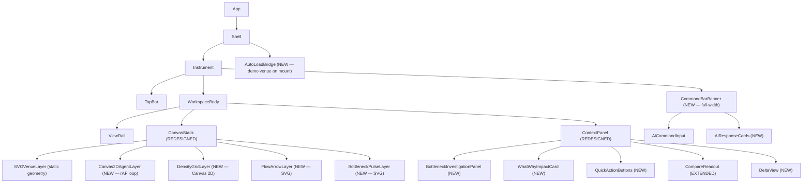
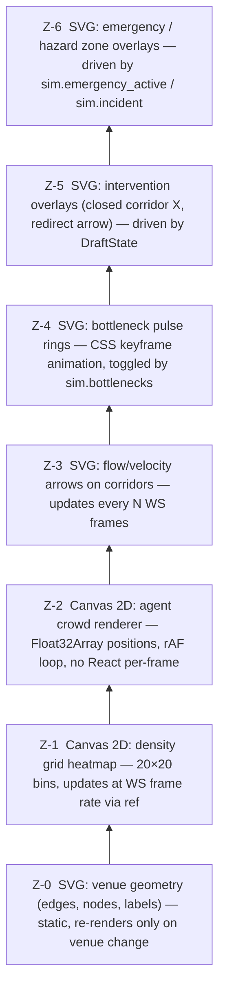
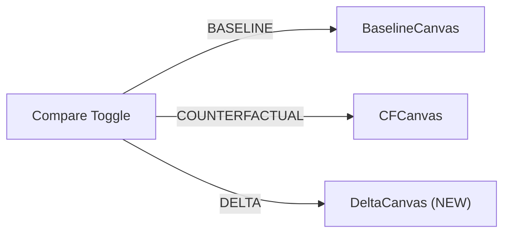

# Design Document: CrowdFlow Vertical Slice — Next-Level Product Build

## Overview

CrowdFlow is being upgraded from an operational simulation dashboard into an **AI-native venue digital twin**. The
current codebase has a solid backend simulation engine (FastAPI + WebSocket + real agent physics) and a functional
frontend workspace, but falls short on visual impact, investigation UX, and the seamless 10-step acceptance flow.
This vertical slice closes all ten gaps with surgical frontend changes: a layered Canvas 2D crowd renderer, a
restructured investigation panel, a prominent full-width AI command bar, a spatial delta comparison view, and an
auto-loading demo venue that puts the experience front-and-center on the very first paint.

The backend simulation engine, WebSocket protocol, Pydantic schemas, and TypeScript types in `lib/types.ts` are
treated as immutable contracts. Every change in this spec is limited to React components, `SimulationContext.tsx`
extensions, and CSS/animation additions.

---

## Architecture

### Component Hierarchy After This Spec




### Rendering Layer Z-Order



All six layers share the same `position: absolute; inset: 0` stacking context inside `CanvasStack`.
The SVG layers use `preserveAspectRatio="xMidYMid meet"` and the same `viewBox`.
The Canvas 2D layers are sized with `width/height` attributes matching the SVG's rendered pixel size
(measured via `ResizeObserver`) and positioned with `position: absolute; top: 0; left: 0`.

---

## Section 1 — Canvas Redesign (InstrumentCanvas)

### 1.1  Separation of Concerns: SVGVenueLayer vs Canvas2DAgentLayer

The existing `InstrumentCanvas.tsx` mixes all rendering into a single SVG element, causing React to
reconcile hundreds of `<circle>` elements every WebSocket frame. The new architecture splits
responsibilities into a **static SVG layer** and a **dynamic Canvas 2D layer**.

**SVGVenueLayer** (extracted from existing InstrumentCanvas, remains React/SVG):
- Renders: edges (corridors), nodes (gates, junctions, zones), labels, iso floor/walls, external env
- Re-renders: only when `venue` prop changes or `sim.edges` / `sim.nodes` risk coloring changes
- Agents: **removed** from SVG entirely
- Bottleneck pulse: replaced by `BottleneckPulseLayer` (see §1.4)
- Hit testing: unchanged — pointer events remain on SVG, same `hitTest()` logic

**Canvas2DAgentLayer** (new file: `InstrumentCanvasAgents.tsx`):

```typescript
// InstrumentCanvasAgents.tsx
interface AgentLayerProps {
  simRef: React.RefObject<SimulationState | null>;  // ref, NOT state — avoids React render
  venue: VenueModel;
  showAgents: boolean;
  // SVG viewBox metrics passed down so Canvas knows how to transform coordinates
  viewBoxX: number;
  viewBoxY: number;
  viewBoxW: number;
  viewBoxH: number;
}
```

The Canvas 2D agent renderer uses a `requestAnimationFrame` loop that:
1. Reads agent positions directly from `simRef.current.agents` (a ref updated by the WS handler)
2. Computes a transform matrix mapping venue coordinates → canvas pixels
3. Clears the canvas
4. Draws all agents as `ctx.arc()` calls with fill color based on `is_emergency` / `is_rerouted`
5. Does **not** call `setState` — zero React render overhead per frame

```typescript
// Coordinate transform (venue space → canvas pixels)
// venueX ∈ [viewBoxX, viewBoxX + viewBoxW]  →  canvasX ∈ [0, canvas.width]
const scaleX = canvas.width / viewBoxW;
const scaleY = canvas.height / viewBoxH;
const toCanvasX = (vx: number) => (vx - viewBoxX) * scaleX;
const toCanvasY = (vy: number) => (vy - viewBoxY) * scaleY;
const agentRadius = Math.max(1.5, (canvas.width / viewBoxW) * (m / 46) * 0.2);
```

**SimulationContext extension** — `simRef` must be exposed:
```typescript
// SimulationContext.tsx — add to the existing context
simRef: React.RefObject<SimulationState | null>;  // NEW — set in ws.onmessage without setState
```

The WS `onmessage` handler sets both `simRef.current = state` (for rAF loop) and calls `setSim(state)`
(for React UI). The rAF loop reads only `simRef.current`, never triggers React reconciliation.

### 1.2  Density Grid Heatmap

A `DensityGridLayer` Canvas 2D element overlays a 20×20 spatial bin grid. It is computed from
`sim.agents` positions and drawn at WS frame rate (not rAF rate — computing 400 bins every 16ms
with 1,200 agents is unnecessary).

```typescript
// DensityGridLayer.tsx
const GRID_W = 20;
const GRID_H = 20;

function computeDensityGrid(
  agents: AgentModel[],
  venueW: number,
  venueH: number
): Float32Array {
  // Float32Array of length GRID_W * GRID_H, each cell = agent count
  const grid = new Float32Array(GRID_W * GRID_H);
  const cellW = venueW / GRID_W;
  const cellH = venueH / GRID_H;
  for (const a of agents) {
    const col = Math.min(GRID_W - 1, Math.floor(a.position.x / cellW));
    const row = Math.min(GRID_H - 1, Math.floor(a.position.y / cellH));
    grid[row * GRID_W + col] += a.scale_units; // scale_units = real people represented
  }
  return grid;
}
```

Rendering: each non-zero cell is drawn as a semi-transparent filled rectangle.
Color interpolation: `hsl(interpolate(120→0), 80%, 50%)` where the input maps
`0 → green`, `max_cell → red`. Alpha is `0.06 + (density / maxDensity) * 0.38`,
keeping the venue geometry visible through the overlay.

The grid layer is only visible when `viewMode === 'density'` or `viewMode === 'crowd'`.

### 1.3  Flow/Velocity Arrows on Corridors

A `FlowArrowLayer` SVG element renders directional arrows on each edge where
`sim.edges[edgeKey].flow_per_min > 5`.

```typescript
// Arrow geometry: midpoint of edge, pointing from source→destination
// Arrow length scales with flow_per_min, capped at corridor half-width
interface FlowArrow {
  midX: number;
  midY: number;
  angleDeg: number;          // direction of flow
  magnitude: number;         // 0–1, relative to corridor capacity
  edgeId: string;
}
```

Arrow rendering uses a small arrowhead SVG path centered at the edge midpoint.
Opacity = `0.4 + magnitude * 0.5`. Color = `var(--od-soft)` for normal flow,
`var(--od-warn)` when `magnitude > 0.7`.

Flow arrows update at the WS frame rate but are throttled to every 3rd frame
(~10fps at 30fps WS) to reduce SVG reconciliation cost.

### 1.4  Bottleneck Pulse Animation

Replace the current inline `od-pulse` class on edges with a dedicated `BottleneckPulseLayer` that
renders pulsing concentric rings at the midpoint of each bottleneck edge/node.

```typescript
// Pulse ring: two SVG circles, offset phase, same center
// CSS keyframe: scale 0.8→1.6, opacity 1→0, duration 1.4s, infinite
// Applied via className="od-bottleneck-pulse" on the outer ring
```

CSS definition (add to `App.css`):
```css
@keyframes bottleneck-pulse {
  0%   { transform: scale(0.8); opacity: 0.9; }
  100% { transform: scale(2.2); opacity: 0; }
}
.od-bottleneck-pulse {
  animation: bottleneck-pulse 1.4s ease-out infinite;
  transform-origin: center;
  transform-box: fill-box;
}
.od-bottleneck-pulse-delay {
  animation: bottleneck-pulse 1.4s ease-out 0.7s infinite;
  transform-origin: center;
  transform-box: fill-box;
}
```

Each active bottleneck renders two rings (offset by half a period) and a BOTTLENECK label badge
positioned above the midpoint. Critical risk = `var(--od-danger)`, High = `var(--od-warn)`.

### 1.5  Intervention Effect Animations

Existing draft overlay logic (closed corridors, redirect arrows) is kept as-is. New additions:

- **Open Gate animation**: when an OPEN_CORRIDOR intervention is applied, a brief framer-motion
  `initial={{ opacity: 0, scale: 0.6 }} animate={{ opacity: 1, scale: 1 }}` expansion plays
  on the newly-opened corridor line.
- **Redirect arc**: the existing dashed REDIRECT line gets a flowing animated dash via
  `stroke-dashoffset` CSS animation, indicating active rerouting in progress.

```css
@keyframes flow-dash {
  to { stroke-dashoffset: -24; }
}
.od-redirect-active {
  stroke-dasharray: 8 4;
  animation: flow-dash 0.6s linear infinite;
}
```

### 1.6  Compare / Delta View

The existing compare mode shows two side-by-side canvases. This spec adds a **DELTA** toggle that
renders a third view: the spatial difference between baseline and counterfactual.



**Compare view layout** (mode = `'compare'`):

```
┌────────────────────────────────────────────────────┐
│  [BASELINE]  [COUNTERFACTUAL]  [DELTA]  ← toggle   │
├──────────────────┬─────────────────────────────────┤
│  Baseline canvas │  Counterfactual OR Delta canvas  │
└──────────────────┴─────────────────────────────────┘
```

**Delta computation** (per edge / node):
```typescript
type DeltaEntry = {
  id: string;
  kind: 'edge' | 'node';
  densityDelta: number;    // cfSim.edges[id].density - sim.edges[id].density
  flowDelta: number;       // positive = more flow in CF
  utilDelta: number;       // positive = more congested in CF
};

function computeDelta(
  base: SimulationState,
  cf: SimulationState
): DeltaEntry[] { ... }
```

**Delta coloring**:
- `densityDelta < -0.05` → green (density decreased, improvement) — `hsl(142, 70%, 45%)`
- `densityDelta > +0.05` → red (density increased, worsening) — `hsl(0, 70%, 50%)`
- `|densityDelta| ≤ 0.05` and `|flowDelta| > threshold` → blue (flow redistributed) — `hsl(210, 70%, 55%)`
- Edge line width = max base width + `Math.abs(densityDelta) * scale`

The delta canvas renders the venue geometry in muted `var(--od-line)` with full-opacity delta coloring
on top, so the spatial structure is always visible as context.


---

## Section 2 — Investigation Panel Redesign (ContextPanel)

### 2.1  When a Bottleneck is Selected: WHAT / WHY / IMPACT

When `mode === 'investigate'` or `mode === 'simulate'` and `selected` points to a bottleneck
location, the right panel renders `BottleneckInvestigationPanel` instead of the generic
`ObjectDetail` component.

**Trigger condition:**
```typescript
const isBottleneckSelected =
  selected !== null &&
  sim?.bottlenecks.some((b) => b.location === selected.id) === true;
```

**Component: `BottleneckInvestigationPanel`**

```typescript
interface BottleneckInvestigationPanelProps {
  bottleneck: Bottleneck;
  elementState: ElementState;
  venueElement: EdgeModel | NodeModel;
  sim: SimulationState;
  venue: VenueModel;
  onDraftIntervention: (i: Intervention) => void;
  onExplainAi: () => void;
  aiExplanation: AiExplainResponse | null;
  aiBusy: boolean;
}
```

**WHAT block** (always visible):
```
┌─────────────────────────────────────────────────┐
│  CONCOURSE_N → CHECKPOINT_N           [CRITICAL] │
│  ── CORRIDOR ───────────────────────────────────  │
│  Density  3.2/m²   Flow  187/min   Queue  94     │
│  Utilisation ████████████ 94%       Capacity 200 │
│  Time-to-critical  ⚠ 1.4 min                     │
└─────────────────────────────────────────────────┘
```

Utilisation renders as an inline progress bar using `width: {util * 100}%` with color
matching the risk level (green / amber / red).

**WHY block** (computed from sim state):

```typescript
// Route concentration: count agents whose route contains this edge
function routeConcentration(sim: SimulationState, edgeId: string): number {
  // edgeId is "SOURCE→DESTINATION"
  const [src, dst] = edgeId.split('→');
  let count = 0;
  for (const agent of sim.agents) {
    // agent.route is an ordered list of node IDs
    for (let i = 0; i < agent.route.length - 1; i++) {
      if (agent.route[i] === src && agent.route[i + 1] === dst) {
        count++;
        break;
      }
    }
  }
  return sim.agents.length > 0 ? count / sim.agents.length : 0;
}
```

Display:
```
WHY
──────────────────────────────────────────────────
62% of active agents route through this corridor.
Demand: 187/min  ·  Corridor capacity: 200/min
Demand exceeds safe throughput by 34%.
Bottleneck engine explanation: [b.explanation text]
```

**IMPACT block** (from Bottleneck + connected edge states):

```typescript
// Cascade risk: edges connected to this bottleneck's source/destination node
function cascadeEdges(
  bottleneck: Bottleneck,
  venue: VenueModel,
  sim: SimulationState
): { id: string; risk: RiskLevel; name: string }[] {
  const [src, dst] = bottleneck.location.split('→');
  return venue.edges
    .filter((e) => e.source === dst || e.destination === src)
    .map((e) => {
      const key = `${e.source}→${e.destination}`;
      const st = sim.edges[key];
      return { id: key, risk: st?.risk ?? 'NORMAL', name: key };
    })
    .filter((e) => e.risk !== 'NORMAL');
}
```

Display:
```
IMPACT
──────────────────────────────────────────────────
Time to critical: ⚠ 1.4 min at current trend
Cascade risk: 2 connected corridors ELEVATED
  · CONCOURSE_N → EXIT_N  [ELEVATED]
  · CHECKPOINT_N → SEAT_N [ELEVATED]
```

### 2.2  INTERVENTIONS Quick Actions

Below the IMPACT block, a set of quick-action buttons draft an intervention **without** navigating
to the Intervene tab. These use `onDraftIntervention` which calls the existing
`s.applyIntervention()` directly from the investigate panel.

```typescript
// Quick actions computed from bottleneck context
type QuickAction = {
  label: string;
  description: string;
  intervention: Omit<Intervention, 'id'>;
  variant: 'warn' | 'ok' | 'ghost';
};

function quickActionsFor(
  bottleneck: Bottleneck,
  venue: VenueModel,
  sim: SimulationState
): QuickAction[] {
  const actions: QuickAction[] = [];
  const [src] = bottleneck.location.split('→');
  // Find alternate routes from the source node
  const alternateExits = venue.edges
    .filter((e) => e.source === src && e.id !== bottleneck.location && e.is_open)
    .slice(0, 2);
  for (const alt of alternateExits) {
    actions.push({
      label: `Open alternate: ${alt.destination}`,
      description: `Redirect flow via ${alt.destination.replace(/_/g, ' ')}`,
      intervention: {
        type: 'REDIRECT',
        description: `Redirect from ${src} via ${alt.destination}`,
        parameters: { from: src, to: alt.destination, pct: 30 },
      },
      variant: 'ok',
    });
  }
  actions.push({
    label: 'Close this corridor',
    description: 'Force reroute all agents away from this segment',
    intervention: {
      type: 'CLOSE_CORRIDOR',
      description: `Close ${bottleneck.location}`,
      parameters: { edge: bottleneck.location },
    },
    variant: 'warn',
  });
  return actions;
}
```

Each quick action button renders as a full-width bordered button with a short description text.
Clicking it calls `onDraftIntervention` immediately — no mode switch required.

### 2.3  AI Explain Button (Inline)

Below the quick actions, a single prominent button:

```
┌────────────────────────────────────────┐
│  [🧠 AI: What can I do?]               │
└────────────────────────────────────────┘
```

Clicking this calls `explainCurrent()` from SimulationContext (already wired to `api.aiExplain`).
The response is rendered inline inside the panel:

```
AI EXPLANATION  ·  gemini-pro
──────────────────────────────────────────
Summary: High footfall through the north
concourse corridor driven by Gate A and B
convergence at CONCOURSE_N.

Cause: 62% agent concentration on a 200/min
capacity corridor during peak entry phase.

Try: Open Gate C redirect · Stagger Gate A
     arrivals · Close CONCOURSE_N→CHECKPOINT_N
```

Each `try_action` from `AiExplainResponse.try_actions` renders as a clickable chip that drafts
the intervention.


---

## Section 3 — AI Command Bar (Prominent Integration)

### 3.1  Layout: CommandBarBanner (Full-Width)

The existing `CommandBar.tsx` is a dropdown triggered by a small TopBar button. This spec promotes
it to a full-width banner rendered between `TopBar` and the workspace body in `Instrument.tsx`.

**New layout in Instrument.tsx:**
```
┌──────────────────────────────────────────────────────┐
│  TopBar (h-12)                                        │
├──────────────────────────────────────────────────────┤
│  CommandBarBanner (h-8 collapsed / h-auto expanded)  │  ← NEW
├──────────────────────────────────────────────────────┤
│  ViewRail │ CanvasStack │ ContextPanel                │
├──────────────────────────────────────────────────────┤
│  Timeline                                            │
└──────────────────────────────────────────────────────┘
```

**Collapsed state** (default):
- Single-line strip, `h-8`, background `var(--od-panel)`, border-bottom `var(--od-line)`
- Left: `🧠 Ask CrowdFlow...` prompt text in `var(--od-muted)` style, cursor pointer
- Right: AI provider status dot + provider name chip
- Clicking anywhere on the strip expands it
- If `sim` is running and has bottlenecks, the prompt pre-fills to a contextual suggestion:
  `"Explain the bottleneck at {topBottleneck.location}"` shown as ghost text

**Expanded state** (framer-motion `AnimatePresence` + `motion.div`):
```typescript
// Animation spec
initial={{ height: 0, opacity: 0 }}
animate={{ height: 'auto', opacity: 1 }}
exit={{ height: 0, opacity: 0 }}
transition={{ duration: 0.18, ease: 'easeOut' }}
```

Expanded content layout:
```
┌────────────────────────────────────────────────────────┐
│ [🧠 Ask CrowdFlow...________________] [INTERPRET] [✕]  │
│                                                        │
│  Suggested:  [Explain bottleneck]  [What can I do?]    │
│              [Open Gate C]         [Run worst case]    │
│                                                        │
│  ← Suggested prompts generated from current sim state  │
└────────────────────────────────────────────────────────┘
```

### 3.2  Suggested Prompts (State-Driven)

Suggested prompts are computed from the current simulation state, not static strings:

```typescript
function suggestedPrompts(
  sim: SimulationState | null,
  aiIdeas: AiSuggestion[]
): string[] {
  const prompts: string[] = [];
  if (sim?.bottlenecks.length) {
    prompts.push(`Explain the bottleneck at ${sim.bottlenecks[0].location}`);
    prompts.push('What can I do about the congestion?');
  }
  if (sim?.status === 'RUNNING') {
    prompts.push('What happens if I close Gate A?');
    prompts.push('Show me the worst-case scenario');
  }
  for (const idea of aiIdeas.slice(0, 2)) {
    prompts.push(idea.title);
  }
  return prompts.slice(0, 4);
}
```

Clicking a suggested prompt fills the input and immediately calls `interpret()`.

### 3.3  Response Rendering: Action Cards (Not Raw Text)

When `preview` (the `AiInterpretResponse`) is available, it renders as a structured card:

```
┌──────────────────────────────────────────────────────────┐
│  Interpreted  ·  confidence 87%  ·  gemini-pro           │
│  ──────────────────────────────────────────────────────  │
│  [close gate A]  [crowd: 1,200]  [HEAVY_RAIN]            │  ← delta fact chips
│                                                          │
│  "Gate A will close, reducing north concourse entry      │
│   capacity by 40%. Combined with heavy rain, outdoor     │
│   routes will see increased load."                       │
│                                                          │
│  [▶ RUN THIS VARIANT]      [run raw]                     │
└──────────────────────────────────────────────────────────┘
```

When `aiExplanation` is available (after `explainCurrent()`):
```
┌──────────────────────────────────────────────────────────┐
│  GROUNDED EXPLANATION  ·  gemini-pro                     │
│  ──────────────────────────────────────────────────────  │
│  {summary}                                               │
│  Cause: {cause}                                          │
│  Try: [action1]  [action2]  [action3]                    │
└──────────────────────────────────────────────────────────┘
```

When `aiBusy` is true, a shimmer loading state replaces the card area:
```typescript
// Shimmer: three lines of different widths using CSS animation
// background: linear-gradient(90deg, var(--od-line) 25%, var(--od-surface) 50%, var(--od-line) 75%)
// animation: shimmer 1.2s infinite
```

### 3.4  Integration Points

The `CommandBarBanner` integrates with existing SimulationContext methods:
- `runAiSimulation(query, delta?)` → run a scenario variant from interpreted input
- `explainCurrent()` → get grounded explanation of current simulation state
- `generateAiIdeas()` → populate suggested prompts list
- `aiBusy`, `aiIdeas`, `aiExplanation`, `aiError` → read-only display

No new context state is required. The banner replaces the existing `CommandBar` dropdown in TopBar —
TopBar.tsx removes the `<CommandBar />` import and the banner is mounted in `Instrument.tsx`.

### 3.5  "Did This Improve?" AI Summary Card

After compare mode is active (`cfSim !== null`), the command bar shows a persistent suggestion chip:
```
"Did this improve the situation?"
```

Clicking it constructs a special prompt that is NOT sent to the AI interpret endpoint but directly
calls `explainCurrent()` on the counterfactual sim:

```typescript
// In CommandBarBanner, when cfSim is available:
const didItHelp = async () => {
  // Switch active simId context to cfSimId to explain the CF result
  // Then restore — handled by passing cfSimId explicitly
  await api.aiExplain(cfSimId);
};
```

The response is augmented in the banner with a structured delta comparison summary drawn from
the metric delta table (see §4.3).


---

## Section 4 — Comparison / Delta View

### 4.1  Compare Mode Layout (Redesigned)

The current compare mode in `Instrument.tsx` uses `grid-cols-2 divide-x`. This spec redesigns it
with a toggle strip at the top and improved visual hierarchy.

```typescript
// CompareViewMode: 'baseline' | 'counterfactual' | 'delta'
type CompareViewMode = 'baseline' | 'counterfactual' | 'delta';

// Stored in Instrument local state, NOT in SimulationContext
const [compareMode, setCompareMode] = useState<CompareViewMode>('counterfactual');
```

**Layout:**
```
┌─────────────────────────────────────────────────────────┐
│  [BASELINE]  [COUNTERFACTUAL ●]  [DELTA]   ← toggle bar │
├──────────────┬──────────────────────────────────────────┤
│  Baseline    │  Counterfactual  OR  Delta               │
│  (always     │  (right pane changes with toggle)        │
│  visible)    │                                          │
└──────────────┴──────────────────────────────────────────┘
```

The left pane always shows the baseline. The right pane shows whichever of
`counterfactual` or `delta` is active. The toggle buttons are rendered as chips
with `is-active` class on the selected mode.

### 4.2  Delta Canvas Rendering

When `compareMode === 'delta'`, the right pane renders `DeltaInstrumentCanvas`:

```typescript
interface DeltaCanvasProps {
  baseSim: SimulationState;
  cfSim: SimulationState;
  venue: VenueModel;
}
```

The delta canvas shares the same SVG viewBox as the baseline canvas. Rendering pipeline:
1. Draw all venue geometry in muted mode: edges as `var(--od-line)` at 30% opacity
2. Compute `DeltaEntry[]` for all edges and nodes
3. For each entry with `|densityDelta| > 0.03`:
   - Edge: draw a thicker line with delta color, opacity proportional to magnitude
   - Node: draw a circle with delta color fill
4. Draw a legend in the bottom-left corner:
   ```
   ▬ Density decreased   ▬ Density increased   ▬ Flow redistributed
   ```

**Delta color scale:**
```typescript
function deltaColor(densityDelta: number, flowDelta: number): string {
  if (densityDelta < -0.05) {
    // Improvement: green
    const intensity = Math.min(1, Math.abs(densityDelta) / 0.3);
    return `hsl(142, 70%, ${45 + intensity * 10}%)`;
  }
  if (densityDelta > 0.05) {
    // Worsening: red
    const intensity = Math.min(1, densityDelta / 0.3);
    return `hsl(0, 70%, ${50 + intensity * 10}%)`;
  }
  if (Math.abs(flowDelta) > 10) {
    // Flow redistributed: blue
    return `hsl(210, 70%, 55%)`;
  }
  return 'var(--od-line)';
}
```

### 4.3  Metric Comparison Table (Animated Deltas)

The `CompareReadout` panel section is extended with animated delta values using framer-motion:

```typescript
// Each delta value animates from 0 to its final value on mount
<motion.span
  initial={{ opacity: 0, y: -4 }}
  animate={{ opacity: 1, y: 0 }}
  transition={{ delay: rowIndex * 0.05 }}
  className={delta < 0 ? 'text-od-ok' : 'text-od-danger'}
>
  {delta >= 0 ? '+' : ''}{delta.toFixed(1)}
</motion.span>
```

Extended metric rows (compared to current implementation):
| Metric | Base | Alt | Δ |
|--------|------|-----|---|
| In venue | — | — | — |
| Avg travel | — | — | — |
| Max utilisation | — | — | — |
| Queue total | — | — | — |
| Bottlenecks | — | — | — |
| Clearance time | — | — | — |
| Avg stress | — | — | — |  ← NEW (from SimulationMetrics)
| Flow/min | — | — | — |    ← NEW

### 4.4  "Did This Help?" AI Summary Card

Below the metric table in the CompareReadout panel:

```
┌────────────────────────────────────────────────────────┐
│  [🧠 Ask: Did this improve the situation?]             │
└────────────────────────────────────────────────────────┘
```

When clicked, calls `api.aiExplain(cfSimId)` and displays the result inline:

```
AI VERDICT  ·  grounded in actual metrics
──────────────────────────────────────────
Queue reduced by 47 people (–50%). Max
utilisation dropped from 94% to 61%.
Clearance time improved by 3.2 minutes.
The intervention is effective — recommend
applying.

[APPLY INTERVENTION]   [DISCARD]
```

The AI summary card is non-blocking — the APPLY INTERVENTION and DISCARD buttons
remain functional even while the AI response is loading.

---

## Section 5 — Demo Venue First Impression

### 5.1  Auto-Load on Mount: AutoLoadBridge

The root cause of the empty-state problem is `App.tsx` line:
```typescript
{!isSecondary && (venue ? <Instrument mode={mode} onMode={go} /> : <CreateTwinView ... />)}
```

`venue` is null on first load even though the demo venue `unity_arena` is seeded in the backend.
The `SimulationContext` already loads venues and selects the first scenario's venue on init —
but the `venue` state isn't set until the async load completes, causing a flash of `CreateTwinView`.

**Fix: `AutoLoadBridge`** — a component that fires `selectVenue('unity_arena')` if
`venues.length > 0` and `venue === null`, then auto-runs the default scenario:

```typescript
// AutoLoadBridge.tsx
function AutoLoadBridge() {
  const s = useSimulation();
  const didAutoLoad = useRef(false);

  useEffect(() => {
    if (didAutoLoad.current) return;
    if (s.venues.length === 0 || s.venue !== null) return;

    didAutoLoad.current = true;
    // Prefer the seeded demo venue
    const demo = s.venues.find((v) => v.id === 'unity_arena') ?? s.venues[0];
    s.selectVenue(demo.id);
    // Auto-select the default scenario
    const defaultScenario =
      s.scenarios.find((sc) => sc.special?.default === true && sc.venue_id === demo.id)
      ?? s.scenarios.find((sc) => sc.venue_id === demo.id)
      ?? null;
    if (defaultScenario) {
      void s.selectScenario(defaultScenario.id);
    }
  }, [s.venues, s.venue, s.scenarios]);

  return null;
}
```

`AutoLoadBridge` is mounted inside `<SimulationProvider>` in `App.tsx`, before `<Shell />`.
This ensures the venue is selected synchronously once the catalog loads, replacing the empty
state gate with the live venue canvas.

### 5.2  Play Button Prominence on First Load

When `venue !== null` and `sim === null`, the `EmptyState` component is shown as a full-screen
overlay on the canvas. Current EmptyState is a small card. This spec redesigns it to be visually
immediate: a centered play button with the scenario name, rendered directly over the venue SVG:

```
┌───────────────────────────────────────────────────────┐
│  [venue SVG fully rendered in background]             │
│                                                       │
│                  Unity Arena                          │
│           Grand Prix Stadium                          │
│                                                       │
│              [  ▶  SIMULATE  ]                       │
│                                                       │
│    Normal Operations · 1,200 agents · 48,000 crowd   │
└───────────────────────────────────────────────────────┘
```

The overlay uses `backdrop-filter: blur(2px)` and `background: rgba(var(--od-canvas-rgb), 0.55)`.
The play button is large: `h-14 px-10 text-base font-bold`. Below it shows the selected scenario
name and crowd size. This ensures the venue is immediately visible and impressive through the
overlay.

### 5.3  First 10 Seconds Experience

1. App loads → `AutoLoadBridge` fires → `venue` is set → `Instrument` renders
2. Canvas renders Unity Arena SVG immediately (no loading spinner for the venue itself)
3. `EmptyState` overlay shows with the redesigned play button over the rendered venue
4. User sees: full venue graph + "SIMULATE" button + scenario name
5. User clicks SIMULATE → `runSimulation()` → agents spawn → canvas animates
6. TopBar already shows the venue name + scenario selector pre-populated
7. CommandBarBanner shows `Ask CrowdFlow...` prompt in collapsed state

The `CreateTwinView` is still reachable via the Rail navigation → Venues, but is no longer the
first thing a user sees.


---

## Section 6 — Performance Architecture

### 6.1  Agent Rendering: Canvas 2D rAF Loop

**Target:** 1,200 simulated agents (each `scale_units ≈ 8–10` real people) at ≥ 30fps in Chrome/Firefox.

**Current bottleneck:** `sim.agents.map((a) => <g key={a.id} transform=...><circle .../></g>)` in
`InstrumentCanvas.tsx` creates 1,200 React elements per WebSocket frame. React reconciliation
for 1,200 moving SVG `<g>` elements is the primary frame budget consumer.

**New approach:**

```typescript
// InstrumentCanvasAgents.tsx
export function Canvas2DAgentLayer({
  simRef,
  viewBoxX, viewBoxY, viewBoxW, viewBoxH,
  canvasWidth, canvasHeight,
}: AgentLayerProps) {
  const canvasRef = useRef<HTMLCanvasElement>(null);
  const rafRef = useRef<number>(0);

  useEffect(() => {
    const canvas = canvasRef.current;
    if (!canvas) return;
    const ctx = canvas.getContext('2d')!;

    // Float32Array buffers — pre-allocated, reused each frame
    // Layout: [x0, y0, x1, y1, ...] for normal agents
    // Separate arrays for rerouted and emergency agents
    const posNormal = new Float32Array(4000 * 2);   // up to 4000 normal agents
    const posRerouted = new Float32Array(400 * 2);
    const posEmergency = new Float32Array(200 * 2);

    const scaleX = canvasWidth / viewBoxW;
    const scaleY = canvasHeight / viewBoxH;
    const agentR = Math.max(1.5, scaleX * 4.0);   // ~4 venue units radius

    function render() {
      const sim = simRef.current;
      ctx.clearRect(0, 0, canvasWidth, canvasHeight);

      if (!sim) {
        rafRef.current = requestAnimationFrame(render);
        return;
      }

      let ni = 0, ri = 0, ei = 0;
      for (const a of sim.agents) {
        const cx = (a.position.x - viewBoxX) * scaleX;
        const cy = (a.position.y - viewBoxY) * scaleY;
        if (a.is_emergency) { posEmergency[ei++] = cx; posEmergency[ei++] = cy; }
        else if (a.is_rerouted) { posRerouted[ri++] = cx; posRerouted[ri++] = cy; }
        else { posNormal[ni++] = cx; posNormal[ni++] = cy; }
      }

      // Batch draw: all normal agents as a single path
      ctx.fillStyle = 'rgba(230, 230, 235, 0.72)';
      ctx.beginPath();
      for (let i = 0; i < ni; i += 2) {
        ctx.moveTo(posNormal[i] + agentR, posNormal[i+1]);
        ctx.arc(posNormal[i], posNormal[i+1], agentR, 0, Math.PI * 2);
      }
      ctx.fill();

      // Rerouted agents — amber
      ctx.fillStyle = 'rgba(245, 158, 11, 0.85)';
      ctx.beginPath();
      for (let i = 0; i < ri; i += 2) {
        ctx.moveTo(posRerouted[i] + agentR, posRerouted[i+1]);
        ctx.arc(posRerouted[i], posRerouted[i+1], agentR * 1.2, 0, Math.PI * 2);
      }
      ctx.fill();

      // Emergency agents — red, larger
      ctx.fillStyle = 'rgba(239, 68, 68, 0.95)';
      ctx.beginPath();
      for (let i = 0; i < ei; i += 2) {
        ctx.moveTo(posEmergency[i] + agentR, posEmergency[i+1]);
        ctx.arc(posEmergency[i], posEmergency[i+1], agentR * 1.5, 0, Math.PI * 2);
      }
      ctx.fill();

      rafRef.current = requestAnimationFrame(render);
    }

    rafRef.current = requestAnimationFrame(render);
    return () => cancelAnimationFrame(rafRef.current);
  }, [simRef, viewBoxX, viewBoxY, viewBoxW, viewBoxH, canvasWidth, canvasHeight]);

  return (
    <canvas
      ref={canvasRef}
      width={canvasWidth}
      height={canvasHeight}
      style={{ position: 'absolute', top: 0, left: 0, pointerEvents: 'none' }}
      aria-hidden="true"
    />
  );
}
```

**Performance characteristics:**
- `ctx.arc()` batch: ~0.2ms for 1,200 circles on a modern GPU
- `ctx.fill()` called 3 times total per frame (3 agent categories)
- No heap allocation per frame — Float32Arrays are pre-allocated
- No React reconciliation per frame — component only re-mounts on prop change
- `pointerEvents: none` so SVG hit testing is not affected

### 6.2  Density Grid: Canvas 2D at WS Frame Rate

The `DensityGridLayer` Canvas 2D element updates at WebSocket frame rate (~2–5fps depending on
simulation speed). It does NOT use rAF — it renders synchronously in a React `useEffect` that
watches `sim.agents`:

```typescript
// DensityGridLayer.tsx
useEffect(() => {
  if (!sim || !visible) return;
  const canvas = canvasRef.current;
  if (!canvas) return;
  const ctx = canvas.getContext('2d')!;
  const grid = computeDensityGrid(sim.agents, venueW, venueH);
  const maxVal = Math.max(1, ...grid);
  const cellW = canvas.width / GRID_W;
  const cellH = canvas.height / GRID_H;

  ctx.clearRect(0, 0, canvas.width, canvas.height);
  for (let row = 0; row < GRID_H; row++) {
    for (let col = 0; col < GRID_W; col++) {
      const val = grid[row * GRID_W + col];
      if (val < 0.5) continue;   // skip empty cells
      const t = val / maxVal;
      const hue = 120 - t * 120;   // green → red
      const alpha = 0.06 + t * 0.38;
      ctx.fillStyle = `hsla(${hue}, 75%, 48%, ${alpha})`;
      ctx.fillRect(col * cellW, row * cellH, cellW, cellH);
    }
  }
}, [sim?.agents, visible, venueW, venueH]);
```

This runs in O(agents + 400) time per WS frame. For 1,200 agents: ~0.5ms compute + ~0.3ms draw.

### 6.3  WebSocket Frame Handling: Off-Render-Cycle

**Current behavior:** `ws.onmessage` calls `setSim(state)` which triggers a React render.
With 1,200 agents, this serializes the JSON, allocates an object, and triggers reconciliation.

**New behavior:**

```typescript
// In SimulationContext.tsx — modify the ws.onmessage handler
ws.onmessage = (event) => {
  if (disposed) return;
  try {
    const state = JSON.parse(event.data as string) as SimulationState;
    if (!state || state.sim_id !== simId) return;

    // 1. Update ref immediately — used by rAF render loop (no React render)
    simRefInternal.current = state;

    // 2. Throttled React state update — only for UI components that need React
    //    Update at most once per 100ms (10fps React render rate for UI panels)
    const now = performance.now();
    if (now - lastReactUpdateMs.current > 100) {
      lastReactUpdateMs.current = now;
      setSim(state);
    }

    // 3. Buffer frame for timeline scrubber (unchanged)
    const t = state.t_min;
    const last = lastBufferedMin.current;
    if (last == null || t - last >= MIN_FRAME_STEP_MIN) {
      lastBufferedMin.current = t;
      setBuffer((prev) => {
        const next = [...prev, compactFrame(state)];
        return next.length > MAX_FRAMES ? next.slice(next.length - MAX_FRAMES) : next;
      });
    }
  } catch { /* ignore malformed frame */ }
};
```

**New context exports:**
```typescript
// SimulationContext.tsx additions
simRef: React.RefObject<SimulationState | null>;  // for rAF agent renderer
cfSimRef: React.RefObject<SimulationState | null>;  // for CF rAF renderer
```

### 6.4  ResizeObserver for Canvas Sizing

The Canvas 2D layers must match the SVG's rendered pixel size (which changes on viewport resize).
A `ResizeObserver` on the canvas container ref provides `{width, height}` as local state,
reused to set `canvas.width`, `canvas.height`, and recalculate the coordinate transform:

```typescript
// useCanvasSize.ts — shared hook
export function useCanvasSize(containerRef: React.RefObject<HTMLElement>): {
  width: number;
  height: number;
} {
  const [size, setSize] = useState({ width: 800, height: 600 });
  useEffect(() => {
    const el = containerRef.current;
    if (!el) return;
    const ro = new ResizeObserver((entries) => {
      const e = entries[0];
      if (e) setSize({ width: e.contentRect.width, height: e.contentRect.height });
    });
    ro.observe(el);
    return () => ro.disconnect();
  }, [containerRef]);
  return size;
}
```

`setSize` re-triggers once on resize — the canvas `width`/`height` attributes update, which
clears the canvas and causes the next rAF tick to redraw at the correct size.


---

## Section 7 — 10-Step Acceptance Flow as Design Scenarios

### Step 1: App loads → demo venue visible immediately

**Trigger:** Browser navigates to `http://localhost:5173`

**Expected state after 500ms:**
- `SimulationProvider` has fetched `/api/venues` and `/api/scenarios`
- `AutoLoadBridge` has called `selectVenue('unity_arena')`
- `venue` state is `{ id: 'unity_arena', name: 'Unity Arena — Grand Prix Stadium', ... }`
- `Instrument` renders (not `CreateTwinView`)
- `SVGVenueLayer` renders the full arena SVG: 6 gates (GATE_A–F), 4 concourses,
  4 checkpoints, pitch, seating blocks, corridors
- `EmptyState` overlay is shown over the SVG with the redesigned play button
- `TopBar` shows "Unity Arena" and the pre-selected scenario dropdown
- `CommandBarBanner` shows collapsed "Ask CrowdFlow..." strip

**Key code path:**
```
App.tsx mounts → SimulationProvider init → listVenues() + listScenarios() resolve
→ AutoLoadBridge.useEffect fires → selectVenue('unity_arena')
→ venue state set → Instrument mounts → SVGVenueLayer renders
→ EmptyState overlay shown
```

**Acceptance check:** SVG canvas is visible with venue geometry before user interaction.

---

### Step 2: User clicks PLAY → simulation starts

**Trigger:** User clicks the `▶ SIMULATE` button in the EmptyState overlay

**Expected behavior:**
- `runSimulation()` called → `POST /api/simulation/run` with `scenario_id`
- `simId` set → WebSocket opens to `/api/simulation/{simId}/live`
- `EmptyState` overlay hides (`sim !== null`)
- First WS frame arrives → `simRef.current` set → rAF loop picks it up
- Agent dots appear on `Canvas2DAgentLayer` within 1 frame (~16ms)
- `TopBar` play/pause button switches to PAUSE state
- `StatusBar` shows "LIVE" with WS connected indicator
- `Timeline` scrubber activates and begins advancing

**Key state transitions:**
```
EmptyState overlay → hidden (sim !== null)
Canvas2DAgentLayer rAF → renders agents from simRef.current
SimulationContext.guided → 'running'
```

**Performance check:** First agent render ≤ 33ms after first WS frame arrives.

---

### Step 3: Density visualization toggle → heatmap appears

**Trigger:** User clicks `density` in the `ViewRail`

**Expected behavior:**
- `setViewMode('density')` called in SimulationContext
- `DensityGridLayer` visibility condition becomes `true`
  (`viewMode === 'density' || viewMode === 'crowd'`)
- `DensityGridLayer.useEffect` fires with current `sim.agents`
- 20×20 grid computed → semi-transparent colored cells drawn over SVG
- High-density areas around CONCOURSE_N show amber/red cells
- Low-density areas show faint green or no color (alpha < 0.06 → skipped)
- Venue geometry (edges, nodes) remains visible through the heatmap

**Visual specification:**
- Grid cells are axis-aligned rectangles in canvas pixel space
- Cell alpha range: 0.06 (1 agent) → 0.44 (max density cell)
- Color range: `hsl(120, 75%, 48%)` → `hsl(0, 75%, 48%)` (green → red)
- No border/outline on cells — pure filled rectangles

---

### Step 4: Bottleneck detection → pulse animation

**Trigger:** Simulation runs for ~2 minutes (t=2.0) → engine detects bottleneck

**Expected behavior:**
- `sim.bottlenecks` array becomes non-empty
- `BottleneckPulseLayer` renders for each bottleneck location
- The affected edge (e.g. `CONCOURSE_N→CHECKPOINT_N`) shows:
  - Two concentric rings pulsing outward at 1.4s cycle (offset by 0.7s)
  - Ring color = `var(--od-warn)` for HIGH, `var(--od-danger)` for CRITICAL
  - "BOTTLENECK" text badge above the midpoint
- `TopBar` bottleneck indicator chip appears: `⚠ CONCOURSE N → CHECKPOINT N`
- `ContextPanel` SystemReadout shows "Top bottleneck" card

**Bottleneck pulse interaction with density grid:**
- When `viewMode === 'density'`, the density cells reinforce the bottleneck location
  visually (same area shows red/amber) — no explicit code required, it's a natural
  emergent layering

---

### Step 5: User clicks bottleneck → WHAT/WHY/IMPACT panel

**Trigger:** User clicks on the pulsing bottleneck edge in the canvas

**Expected behavior:**
- `hitTest()` returns `{ kind: 'edge', id: 'CONCOURSE_N→CHECKPOINT_N' }`
- `setSelected({ kind: 'edge', id: 'CONCOURSE_N→CHECKPOINT_N' })` called
- `isBottleneckSelected` → `true` (location matches a bottleneck)
- `ContextPanel` renders `BottleneckInvestigationPanel`:
  - **WHAT**: Location label, CRITICAL badge, density/flow/queue/utilisation metrics,
    utilisation progress bar, time-to-critical countdown
  - **WHY**: Route concentration % computed from `sim.agents`, demand vs capacity gap
  - **IMPACT**: Time-to-critical, cascade edges list
  - **INTERVENTIONS**: Quick-action buttons for alternate routes and close
  - **AI Explain**: `[🧠 What can I do?]` button

**If `mode !== 'investigate'`:** The panel still shows the investigation view since the
bottleneck detection overrides generic ObjectDetail. The mode tab does NOT need to change.

**Specification:** The `isBottleneckSelected` flag in `ContextPanel` is computed as:
```typescript
const isBottleneckSelected = !!(
  selected &&
  sim?.bottlenecks.some((b) => b.location === selected.id)
);
```

---

### Step 6: User clicks "What can I do?" → AI Ideas expand inline

**Trigger:** User clicks `[🧠 What can I do?]` button in the investigation panel

**Expected behavior:**
- `explainCurrent()` called → `POST /api/ai/explain { sim_id }`
- `aiBusy` → `true` → loading shimmer shown in the AI response area
- Response arrives → `aiExplanation` set
- Panel expands to show AI explanation inline (within ContextPanel, no mode switch):
  ```
  AI EXPLANATION  ·  gemini-pro
  ─────────────────────────────
  Summary: [explanation text]
  Cause: [cause text]
  Try: [action chip 1]  [action chip 2]
  ```
- Each `try_action` chip renders as a clickable button that calls `onDraftIntervention`

**CommandBarBanner** simultaneously: the "Ask CrowdFlow..." prompt updates to suggest
`"What can I do about the bottleneck at CONCOURSE_N→CHECKPOINT_N?"`

**If AI is not configured:** The button shows `"AI not configured"` in muted style.
The quick-action buttons (from §2.2) remain functional without AI.

---

### Step 7: User clicks "Open Gate C" suggestion → Intervention drafted

**Trigger:** User clicks a quick-action chip or AI try_action chip for opening an alternate gate

**Expected behavior for quick-action:**
- `onDraftIntervention({ type: 'REDIRECT', ... })` called
- `s.applyIntervention(intervention)` called immediately
- Simulation state updates — agents reroute on next tick
- Canvas shows redirect animation: dashed animated arrow from congested node to alternate
- Applied intervention appears in `sim.interventions_applied`
- `ContextPanel` Interventene section shows the applied intervention

**If user clicks AI try_action chip "REDIRECT to GATE_C":**
- The chip constructs an intervention from `AiExplainResponse.try_actions[i]`:
  ```typescript
  const intervention: Intervention = {
    id: crypto.randomUUID(),
    type: action.type,
    description: action.description,
    parameters: action.parameters,
  };
  onDraftIntervention(intervention);
  ```

---

### Step 8: User clicks "Run Counterfactual" → parallel simulation forks

**Trigger:** User clicks `[RUN AS COUNTERFACTUAL]` button (shown in canvas top-right when
`mode === 'intervene'`) or the `[Run Counterfactual]` button in an AI response card

**Expected behavior:**
- `runCounterfactual(intervention)` called → `POST /api/simulation/{simId}/counterfactual`
- Backend forks the simulation engine, applies the intervention, returns new `SimulationState`
- `cfSimId` set → second WebSocket opens to `/api/simulation/{cfSimId}/live`
- `onMode('compare')` called → compare mode activates
- Both canvases render simultaneously:
  - Left: baseline simulation (original `simId` WS stream)
  - Right: counterfactual simulation (`cfSimId` WS stream)
- Both have their own rAF agent layers (each reads from `simRef` and `cfSimRef` respectively)
- `CompareToggle` strip shows `[BASELINE]  [COUNTERFACTUAL ●]  [DELTA]`

**Two rAF loops running simultaneously** — each Canvas2DAgentLayer has its own `useEffect` loop
keyed to its own `simRef`. The two loops are independent and do not share state.

---

### Step 9: Compare view → side-by-side + DELTA toggle

**Trigger:** Compare mode is active (from Step 8)

**Expected state:**
- Left pane: baseline canvas with original agent density distribution
- Right pane: counterfactual canvas (default) showing rerouted agents (amber dots visible)
- Toggle strip at top: `[BASELINE] [COUNTERFACTUAL ●] [DELTA]`
- `ContextPanel` shows `CompareReadout` with animated metric deltas:
  - Queue total: `94 → 47  Δ −47` in green
  - Bottlenecks: `3 → 1  Δ −2` in green
  - Avg travel: `4.2 → 3.8  Δ −0.4` in green

**User clicks DELTA toggle:**
- `compareMode` → `'delta'`
- Right pane switches to `DeltaInstrumentCanvas`
- Delta canvas shows muted venue geometry
- Green overlays on corridors where density decreased (away from CONCOURSE_N)
- Red/unchanged on the congested corridor if intervention didn't help there
- Flow redistribution arrows: blue on the newly-active alternate routes

---

### Step 10: User types "Did this improve?" → AI explains grounded in metrics

**Trigger:** User types "Did this improve the situation?" in `CommandBarBanner` input
OR clicks the `[🧠 Ask: Did this improve the situation?]` chip in CompareReadout

**Expected behavior:**
- `api.aiExplain(cfSimId)` called (NOT the baseline `simId`)
- `aiBusy` → `true` → shimmer loading in CommandBarBanner response area
- Response arrives → displayed as structured card:
  ```
  AI VERDICT  ·  gemini-pro  ·  grounded in actual metrics
  ──────────────────────────────────────────────────────────
  Queue at CONCOURSE_N reduced from 94 to 47 people (−50%).
  Max utilisation dropped from 94% to 61% — below critical
  threshold. Clearance time improved by 3.2 minutes.

  The Gate C redirect is effective. Recommend applying.

  [APPLY INTERVENTION]    [DISCARD]
  ```

**Grounding mechanism:** The AI explanation is from `api.aiExplain(cfSimId)` which has the
counterfactual simulation metrics in its context (the backend reads the engine state for that
`sim_id` and includes metrics in the prompt). The metric delta display in the CompareReadout
panel is computed client-side from `sim.metrics` vs `cfSim.metrics` and shown alongside the
AI verdict.

**APPLY INTERVENTION button:**
- Calls `s.applyCounterfactual()` → applies the intervention to the baseline simulation
- `discardCounterfactual()` called
- Mode returns to `'simulate'`
- The main simulation now has the intervention applied


---

## Data Models

### New / Extended Context State

```typescript
// Additions to SimulationContextValue (SimulationContext.tsx)
interface SimulationContextValue {
  // ... all existing fields ...

  // NEW: refs for rAF loops (no React render overhead)
  simRef: React.RefObject<SimulationState | null>;
  cfSimRef: React.RefObject<SimulationState | null>;

  // NEW: compare view mode (local to Instrument, but lifted here for CommandBar access)
  compareViewMode: CompareViewMode;
  setCompareViewMode: (m: CompareViewMode) => void;
}

type CompareViewMode = 'baseline' | 'counterfactual' | 'delta';
```

### DeltaEntry (new local type, not in lib/types.ts)

```typescript
// frontend/src/lib/delta.ts  — new file
export interface DeltaEntry {
  id: string;               // edgeKey or nodeId
  kind: 'edge' | 'node';
  densityDelta: number;     // cfSim density - base density
  flowDelta: number;        // cfSim flow_per_min - base flow_per_min
  utilDelta: number;        // cfSim utilisation - base utilisation
  riskChanged: boolean;     // risk level changed between base and cf
}

export function computeDelta(
  base: SimulationState,
  cf: SimulationState
): DeltaEntry[] {
  const entries: DeltaEntry[] = [];
  for (const [id, bSt] of Object.entries(base.edges)) {
    const cfSt = cf.edges[id];
    if (!cfSt) continue;
    entries.push({
      id,
      kind: 'edge',
      densityDelta: cfSt.density - bSt.density,
      flowDelta: cfSt.flow_per_min - bSt.flow_per_min,
      utilDelta: cfSt.utilisation - bSt.utilisation,
      riskChanged: cfSt.risk !== bSt.risk,
    });
  }
  for (const [id, bSt] of Object.entries(base.nodes)) {
    const cfSt = cf.nodes[id];
    if (!cfSt) continue;
    entries.push({
      id,
      kind: 'node',
      densityDelta: cfSt.density - bSt.density,
      flowDelta: cfSt.flow_per_min - bSt.flow_per_min,
      utilDelta: cfSt.utilisation - bSt.utilisation,
      riskChanged: cfSt.risk !== bSt.risk,
    });
  }
  return entries;
}
```

### QuickAction (new local type)

```typescript
// frontend/src/lib/quickActions.ts — new file
export interface QuickAction {
  label: string;
  description: string;
  intervention: Omit<Intervention, 'id'>;
  variant: 'warn' | 'ok' | 'ghost';
}
```

---

## Components and Interfaces

### New Files

| File | Purpose |
|------|---------|
| `frontend/src/components/workspace/InstrumentCanvasAgents.tsx` | Canvas 2D agent renderer, rAF loop |
| `frontend/src/components/workspace/DensityGridLayer.tsx` | Canvas 2D density heatmap |
| `frontend/src/components/workspace/FlowArrowLayer.tsx` | SVG flow direction arrows |
| `frontend/src/components/workspace/BottleneckPulseLayer.tsx` | SVG bottleneck pulse rings |
| `frontend/src/components/workspace/BottleneckInvestigationPanel.tsx` | WHAT/WHY/IMPACT panel |
| `frontend/src/components/workspace/CommandBarBanner.tsx` | Full-width AI command bar (replaces CommandBar.tsx) |
| `frontend/src/components/workspace/DeltaInstrumentCanvas.tsx` | Spatial delta view canvas |
| `frontend/src/components/workspace/AutoLoadBridge.tsx` | Auto-load demo venue on mount |
| `frontend/src/lib/delta.ts` | Delta computation utilities |
| `frontend/src/lib/quickActions.ts` | Quick action computation utilities |
| `frontend/src/hooks/useCanvasSize.ts` | ResizeObserver hook for canvas sizing |

### Modified Files

| File | Change |
|------|--------|
| `SimulationContext.tsx` | Add `simRef`, `cfSimRef`, `compareViewMode`, throttle WS→React updates |
| `InstrumentCanvas.tsx` | Remove agent SVG elements; add layer props; extract to SVGVenueLayer |
| `Instrument.tsx` | Mount `CommandBarBanner` between TopBar and workspace; update compare view |
| `ContextPanel.tsx` | Add `BottleneckInvestigationPanel` conditional; extend `CompareReadout` |
| `App.tsx` | Mount `AutoLoadBridge` inside `SimulationProvider` |
| `TopBar.tsx` | Remove `CommandBar` import |
| `App.css` | Add bottleneck pulse, flow-dash, shimmer keyframes |

### Key Interface: CanvasStack

```typescript
// The new CanvasStack div in InstrumentCanvas.tsx — absolute-positioned layers
interface CanvasStackProps {
  // All existing InstrumentCanvas props
  // Plus:
  showDensity: boolean;   // derived from viewMode
  showFlow: boolean;      // derived from viewMode
}
```

The `CanvasStack` is a single `<div style={{ position: 'relative', height: '100%', width: '100%' }}>`.
Each layer inside uses `position: absolute; inset: 0`.

---

## Error Handling

### AI Unavailable

The `CommandBarBanner` checks `aiConfigured` from context. When `false`:
- Input is disabled with placeholder "AI not configured — check Settings"
- Quick-action buttons in `BottleneckInvestigationPanel` remain functional
- The "What can I do?" button shows as disabled with tooltip "Configure AI in Settings"

### WebSocket Disconnection

Existing WS error handling (already in `SimulationContext.tsx`) continues unchanged.
The rAF loop reads from `simRef.current` — if the ref is stale (WS disconnected),
agents render at their last known positions until reconnection. No special handling needed.

### Canvas Not Supported

```typescript
const ctx = canvas.getContext('2d');
if (!ctx) {
  // Log warning, return early — SVG fallback (existing agent dots) remains visible
  return;
}
```

The SVG agent dots in `SVGVenueLayer` are removed by default. If the Canvas 2D context
fails to initialize, a fallback SVG agent layer is conditionally rendered:
```typescript
const [canvasSupported, setCanvasSupported] = useState(true);
// Set to false in Canvas2DAgentLayer if ctx is null
// SVGVenueLayer conditionally renders fallback circles when canvasSupported === false
```

### Empty State With No Venues

If `s.venues.length === 0` after the catalog loads (backend not seeded), `AutoLoadBridge`
does nothing. `CreateTwinView` is shown as before. The `EmptyState` overlay's import button
links to the Venues screen. No regression from current behavior.

---

## Testing Strategy

### Unit Testing

- `computeDensityGrid()`: given a set of agent positions, verify correct bin assignment;
  verify `scale_units` is accumulated, not agent count; verify boundary agents land in
  correct edge bins.
- `computeDelta()`: given two `SimulationState` objects with known edge states,
  verify correct `densityDelta` and `flowDelta` values; verify missing edges are skipped.
- `routeConcentration()`: given agents with routes containing a known edge, verify
  the fraction is computed correctly; verify agents not on the route don't count.
- `quickActionsFor()`: given a bottleneck and venue, verify at least one action is
  generated; verify CLOSE_CORRIDOR action always included.
- `suggestedPrompts()`: given a sim with bottlenecks, verify first prompt mentions the
  bottleneck location; verify max 4 prompts returned.
- `AutoLoadBridge`: verify it only fires once (`didAutoLoad.current` guard);
  verify it prefers `unity_arena` over other venues.

### Property-Based Testing

**Property test library:** fast-check

```typescript
// Property: computeDensityGrid total agent coverage
// For any set of agents within venue bounds, sum of all bins equals sum of scale_units
fc.property(
  fc.array(fc.record({ position: { x: fc.float(0, 1000), y: fc.float(0, 620) }, scale_units: fc.integer(1, 10) }), { maxLength: 2000 }),
  (agents) => {
    const grid = computeDensityGrid(agents as AgentModel[], 1000, 620);
    const gridSum = grid.reduce((a, b) => a + b, 0);
    const agentSum = agents.reduce((a, b) => a + b.scale_units, 0);
    return Math.abs(gridSum - agentSum) < 0.001;
  }
);

// Property: deltaColor never returns empty string
fc.property(
  fc.float(-1, 1),
  fc.float(-200, 200),
  (densityDelta, flowDelta) => {
    const color = deltaColor(densityDelta, flowDelta);
    return color.length > 0;
  }
);
```

### Integration Testing

- Render `Instrument` with a mocked SimulationContext that has `venue = unityArena`,
  `sim = runningState`, `sim.bottlenecks = [criticalBottleneck]` — verify
  `BottleneckPulseLayer` renders, verify `Canvas2DAgentLayer` mounts.
- Render `ContextPanel` in `investigate` mode with a selected bottleneck ID —
  verify `BottleneckInvestigationPanel` renders (not generic ObjectDetail).
- Render `CommandBarBanner` with `aiConfigured = false` — verify input is disabled.
- Render compare mode with `cfSim` and click DELTA — verify `DeltaInstrumentCanvas` mounts.

---

## Performance Considerations

| Scenario | Target | Mechanism |
|----------|--------|-----------|
| 1,200 agents at 30fps | ≥ 30fps canvas, ≥ 10fps React UI | rAF loop reads ref, throttle WS→setState to 10fps |
| Density grid update | < 2ms per WS frame | O(agents + 400) Float32Array compute |
| Compare mode (2× WS streams) | Both canvases ≥ 20fps | Two independent rAF loops, same approach |
| Delta computation on toggle | < 5ms | O(edges + nodes), ~35 entries for Unity Arena |
| Canvas resize | No jank | ResizeObserver sets canvas attributes, next rAF redraws |
| SVG bottleneck pulse | Zero JS cost | Pure CSS `@keyframes` animation |

---

## Security Considerations

- No new backend endpoints are introduced — all AI calls go through existing `api.aiExplain`,
  `api.aiSuggest`, and `api.aiInterpret` which proxy to the backend (server-side keys only).
- `AutoLoadBridge` reads only from existing context state — no new API calls.
- Canvas 2D rendering reads `sim.agents` which is already in React state — no new data sources.
- The `deltaColor()` function receives only numeric values derived from `SimulationState` —
  no user input is interpolated into CSS strings.

---

## Dependencies

No new npm packages are required. All capabilities use:

| Capability | Package | Already installed |
|-----------|---------|------------------|
| rAF loop + Canvas 2D | Browser API | ✓ |
| Framer-motion animations | `framer-motion` | ✓ |
| ResizeObserver | Browser API | ✓ |
| SVG rendering | React DOM | ✓ |
| AI API calls | existing `lib/api.ts` | ✓ |
| TypeScript types | existing `lib/types.ts` | ✓ (unmodified) |


---

## Correctness Properties

### P1 — Agent Rendering Completeness
For every agent in `sim.agents`, exactly one Canvas 2D arc is drawn per frame.
No agent is skipped; no agent is drawn twice. Formally:
`∀ frame f: |arcs drawn in f| = |sim.agents| at the time of the rAF callback`

### P2 — Density Grid Conservation
The sum of all density grid cells equals the sum of `scale_units` across all agents:
`∑ grid[i] = ∑ a.scale_units for all a in sim.agents`

### P3 — Delta Symmetry
`computeDelta(base, cf).densityDelta === -computeDelta(cf, base).densityDelta`
(swapping base and counterfactual negates the delta)

### P4 — Bottleneck Panel Exclusivity
When `isBottleneckSelected` is true, `BottleneckInvestigationPanel` renders.
When `isBottleneckSelected` is false, `ObjectDetail` renders.
These states are mutually exclusive.

### P5 — AutoLoadBridge Idempotency
`AutoLoadBridge.useEffect` sets `didAutoLoad.current = true` before calling `selectVenue`.
Subsequent renders of the effect do not call `selectVenue` again (idempotency guarantee).

### P6 — WS Ref vs State Consistency
`simRef.current` is always equal to or more recent than `sim` (React state).
The ref is set before `setSim` is called (or in lieu of `setSim` when throttled).
The rAF loop can therefore safely read from `simRef.current` without stale data.

### P7 — Compare Mode Delta Coverage
`computeDelta` returns an entry for every edge and node that exists in **both** base and cf
simulation states. Edges/nodes present in only one state are skipped (no partial delta).

### P8 — Quick Action Non-Empty
`quickActionsFor(bottleneck, venue, sim)` always returns at least one action
(the CLOSE_CORRIDOR action is always appended as a fallback regardless of alternate routes).

### P9 — Canvas Layer Stacking Correctness
`pointer-events: none` is set on all Canvas 2D layers. The SVG layer (Z-0) is the only
layer that receives pointer events. Hit testing behavior is unchanged from the existing
implementation.

### P10 — Command Bar Idempotency
Clicking `[INTERPRET]` multiple times while `interpreting === true` is a no-op
(button is `disabled` during interpretation). The state machine only allows one
in-flight interpretation at a time.
